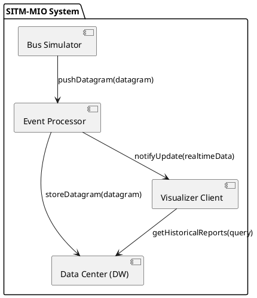

# Plan de Arquitectura: Sistema de Monitoreo y Análisis SITM-MIO

## 1. Diagrama de Componentes (Vista Lógica)

## 2. Responsabilidades de los Subproyectos

### A. Bus Simulator (bus-simulator)
- **Rol**: Productor de eventos.
- **Responsabilidad**: Lee archivos CSV históricos y genera un flujo de datagramas simulando la operación en tiempo real.
- **Interacción**: Actúa como cliente Ice que invoca métodos en el Event Processor.

### B. Event Processor (event-processor)
- **Rol**: Orquestador y Filtro.
- **Responsabilidad**: Recibe datagramas, valida su integridad, normaliza las coordenadas (de entero a decimal) y clasifica el evento según su criticidad. Implementa el patrón Publisher-Subscriber para notificar al Visualizer en tiempo real.
- **Interacción**: Servidor Ice para los buses y cliente para el Data Center y Visualizer.

### C. Data Center / Data Warehouse (data-center)
- **Rol**: Almacén Persistente.
- **Responsabilidad**: Almacena todos los datagramas recibidos para análisis posterior. Implementa la lógica de cálculo de velocidad promedio por ruta (lineId) mediante agregaciones mensuales.
- **Interacción**: Servidor Ice que ofrece servicios de persistencia y consulta de reportes.

### D. Visualizer Client (visualizer-client)
- **Rol**: Consumidor y Presentación.
- **Responsabilidad**: Interfaz gráfica que muestra el mapa de Cali con los buses en movimiento y permite consultar los reportes de velocidad generados por el Data Center.
- **Interacción**: Suscriptor de eventos en tiempo real y cliente de consultas históricas.

## 3. Flujo de Datos y Protocolo RPC (Ice)

1. **Ingesta**: El Bus Simulator invoca processDatagram(data) en el Event Processor.
2. **Procesamiento**: El Event Processor transforma las coordenadas y decide:
   - Enviar a Data Center mediante archive(data) (Asíncrono/Unidireccional para rendimiento).
   - Enviar a Visualizer mediante un callback updateLocation(busId, pos) si el visualizador está activo.
3. **Análisis**: El Data Center procesa lotes de datos para calcular la velocidad promedio (Delta Odometer / Delta Time).
4. **Consulta**: El Visualizer solicita getAverageSpeed(lineId, month) al Data Center.

## 4. Patrones de Diseño Sugeridos

- **Observer / Pub-Sub**: Para la actualización de posiciones en tiempo real sin que el Event Processor dependa fuertemente del Visualizer.
- **Strategy Pattern**: Para el filtrado de eventos.
- **Data Transfer Object (DTO)**: Definidos en Slice para asegurar que los objetos que viajan por la red sean ligeros y tipados.
- **Repository Pattern**: En el Data Center para abstraer el almacenamiento físico de la lógica de negocio de los reportes.

## 5. Definición de Interfaces (Contratos Previstos)

- **DatagramReceiver**: Interfaz expuesta por el Event Processor.
- **ArchiveService**: Interfaz expuesta por el Data Center.
- **MonitoringSubscriber**: Interfaz de callback para el Visualizer.
- **ReportProvider**: Interfaz para consultas de velocidad y estadísticas.
